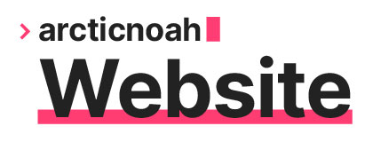

    
     
    <b>My personal hub for all things me :)</b>
     
     
    

 

> Built using [Hugo](https://gohugo.io) with an edited version of the [hello-friend](https://github.com/panr/hugo-theme-hello-friend) theme. Hosted with [Netlify](https://netlify.com/).

# Versions:

Currently Hosted Version: **v1.2** (master)

Experimental Version: **v1.3-alpha** (experimental_1.3)

# Changelog:

- **v1.2**
    - Contact section has been added.
        - Includes a list of my social media links.
        - Email form has been added, lets users send an 'email' to me directly without revealing my email publicly.
    - Image carousels widget has been added.
        - Lets multiple images be present via a slideshow, in a single space.
        - Using the library: [embla-carousel](https://github.com/davidcetinkaya/embla-carousel), to add this feature.
    - Image zooming has been added.
        - Images can be viewed in fullscreen now by clicking/tapping any content image.
        - Using the library: [medium-zoom](https://github.com/francoischalifour/medium-zoom), to add this feature.
    - Custom audio player widget has been added.
        - Consistent style across browsers and devices.
        - Has the most common/important features of a browser audio player.
        - Auto pausing of other audio sources when a new one starts to play.
    - Updated style sheet.
        - New, improved contrast, dark theme.
        - Selection highlighting with accent colour.
        - Improved drop shadow by reducing its 'spread' and adjusting it for the dark theme.
    - Small adjustments:
        - Portfolio section stays on the URL path '/portfolio' only now, rather than sometimes using '/categories' (due to Hugo taxonomies).
    - Bug fixes:
        - Fixed some breadcrumb inconsistencies.
        - Mobile scaling should be more consistent now.
  
- **v1.1**
    - Portfolio section has been added.
        - Projects are categorised via 'category' taxonomy, since I have various interests.
        - Categories are represented with a preview GIF, that is generated from the covers for each project.
        - Currently hidden from users as there is no content (yet).
    - Daily log section has been added.
        - Uses nearly identical code to the already existing blog section.
        - Daily logs are categorised via 'focus' taxonomy, again since I have various interests.
  
- **v1.0**
    - Base website functionality.
        - About page is present on the homepage (for now).
        - Blog section is present.
    - Website hosting done with [Netlify](https://netlify.com) (free tier).
        - Added [Forestry.io](https://Forestry.io) as an option for remote editing of the site's content.
  
# Planned Features:

- Contact Page/Form
- Commission Section/Form
- CV/Resume
