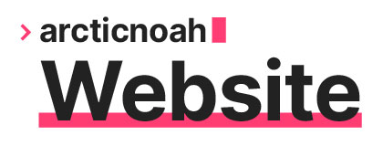

# arcticnoah Website

    
     
    <b>My personal hub for all things me :)</b>
     
     
    

 

> Built using [Hugo](https://gohugo.io) with an edited version of the [hello-friend](https://github.com/panr/hugo-theme-hello-friend) theme. Hosted with [Netlify](https://netlify.com/).

## Versions

Currently Hosted Version: **v1.3-alpha** [[master](https://github.com/arcticnoah/arcticnoah-website/tree/master)]

<!-- Experimental Version (*Which is currently not in use...*): **v1.3-alpha** [[experimental_1.3](https://github.com/arcticnoah/arcticnoah-website/tree/master)] -->

## Changelog

- **v1.3-alpha (all subject to change)**
  - To-do list section for daily log posts has been added.
    - Includes a to-do list key that can be toggled.
    - Custom checkboxes (via CSS) has been added as they allow more styling.
  - Portfolio changes.
    - Category pages now function much the same as the main portfolio page where you pick the category.
    - Hover actions are now simulated on mobile/tablets via an intersection observer.
    - Improved build script to only render the updated pages' GIFs.
  - Hugo archetypes has been added.
    - A simple script has been added to simplify the command to generate blank content pages quickly.
  - Small adjustments:
    - Removed/disabled unused script imports.
    - Menu items are now ordered by a weight attribute.
    - Image zooming is currently disabled as it makes image carousels difficult to use. Hopefully this will be fixed soon...

- **v1.2**
  - Contact section has been added.
    - Includes a list of my social media links.
    - Email form has been added, lets users send an 'email' to me directly without revealing my email publicly.
  - Image carousels widget has been added.
    - Lets multiple images be present via a slideshow, in a single space.
    - Using the library: [embla-carousel](https://github.com/davidcetinkaya/embla-carousel), to add this feature.
  - Image zooming has been added.
    - Images can be viewed in full screen now by clicking/tapping any content image.
    - Using the library: [medium-zoom](https://github.com/francoischalifour/medium-zoom), to add this feature.
  - Custom audio player widget has been added.
    - Consistent style across browsers and devices.
    - Has the most common/important features of a browser audio player.
    - Auto pausing of other audio sources when a new one starts to play.
  - Updated style sheet.
    - New, improved contrast, dark theme.
    - Selection highlighting with accent colour.
    - Improved drop shadow by reducing its 'spread' and adjusting it for the dark theme.
  - Small adjustments:
    - Portfolio section stays on the URL path '/portfolio' only now, rather than sometimes using '/categories' (due to Hugo taxonomies).
  - Bug fixes:
    - Fixed some breadcrumb inconsistencies.
    - Mobile scaling should be more consistent now.

- **v1.1**
  - Portfolio section has been added.
    - Projects are categorised via 'category' taxonomy, since I have various interests.
    - Categories are represented with a preview GIF, that is generated from the covers for each project.
    - Currently hidden from users as there is no content (yet).
  - Daily log section has been added.
    - Uses nearly identical code to the already existing blog section.
    - Daily logs are categorised via 'focus' taxonomy, again since I have various interests.

- **v1.0**
  - Base website functionality.
    - About page is present on the homepage (for now).
    - Blog section is present.
  - Website hosting done with [Netlify](https://netlify.com) (free tier).
    - Added [Forestry.io](https://Forestry.io) as an option for remote editing of the site's content.

## Planned Features

- Commission Section/Form
- CV/Resume
